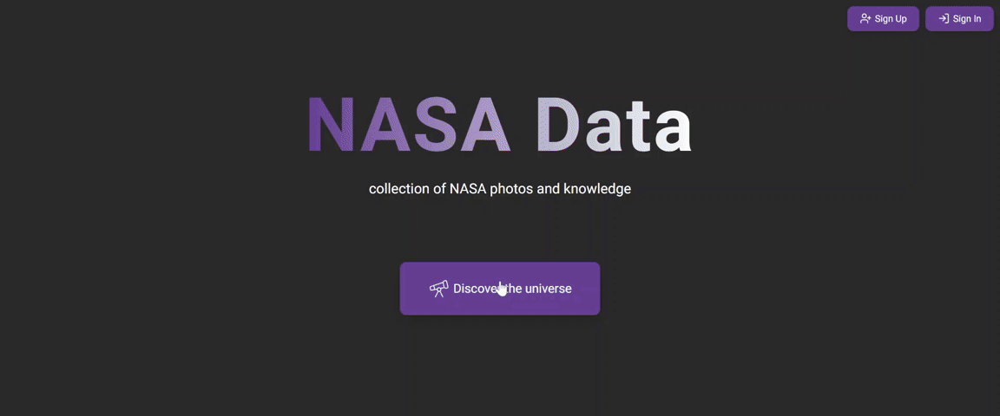

# NASA Data

Приложение с данными [NASA](https://api.nasa.gov/).

## Deployment & Live Demo

[Deploy](https://datanasa.netlify.app/)



## Technologies Used

- Typescript
- React
- Next.js
- Redux Toolkit
- Firebase (Authentication, Firestore)
- Tailwind CSS
- SCSS (Sass)
- Formik, Yup
- Webpack
- ESLint, Prettier
- Nasa API

## Features

- Отображение фотографии/видео дня (ISR)
- Поиск фотографий
- Информация о фото в модальном окне (название, полный размер фото, дата, центр/копирайт, описание)
- Отображение подборки фотографий "фото дня" перед выполнением поиска (SSR)
- Пагинация
- Регистрация (firebase) по почте и паролю
- Авторизация (firebase)
- Валидация форм регистрации и авторизации
- Отправка письма для подтверждения почты при регистрации
- Добавление фотографий в коллекцию (firestore) - кастомный хук useFavorites
- Страница профиля
- Отображение коллекции фото в профиле
- Сортировка добавленных фотографий по датам
- Редактирование профиля (доступно при подтверждённой почте)
- Собственный UI и универсальные UI-компоненты (кнопки, инпуты, модальные окна, карточки фото, дропдауны)

## More details

### Routing

- App Router. Хуки usePathname, useRouter из next/navigation
- Защита маршрутов с помощью AuthContext
- Контент скрыт до завершения аутентификации
- Редирект на профиль после регистрации и авторизации
- Редирект с адреса профиля на страницу авторизации для неавторизованных пользователей
- Страницы:
  - Главная страница
  - Main (Photo of the day)
  - Search (поиск фото)
  - Registration
  - Login
  - Profile

### State Management

- createAsyncThunk для запросов к API
- slices для состояний фото и избранного
- firestore для хранения данных о юзере и его коллекции фотографий
- Синхронизация между redux-стором и firestore

### Loading & Error Handling

- Спиннер при загрузке (поиск фото, загрузка профиля)
- Модальные окна с сообщениями:
  - Успешная и неуспешная регистрация/авторизация
  - Ошибка при загрузке данных профиля
- Общая страница ошибки error.tsx

### Form Validation

- Валидация форм регистрации и авторизации с Yup и Formik
- Регистрация: имя, почта (соответствие формату), пароль (не менее 6 символов)
- Все поля обязательны для заполнения
- Кнопка submit отключена при некорректном заполнении полей

### Profile

- Имя, почта
- Дата создания аккаунта и дата последнего входа (создана функция formatDate для преобразования Timestamp в Date)
- Редактирование профиля
- Коллекция фото
- Сортировка фото по дате

### Performance Optimizations

- next/image для изображений
- next/font для шрифтов
- revalidate для кэширования результата запроса

### Styling and Responsiveness

- Адаптивная вёрстка до 360px ширины экрана (Tailwind CSS)
- Навигационная панель складывается в бургер-меню при ширине менее 912px
- Модальные окна подстраиваются под контент (фото/сообщение)
- Кнопки поиска и отправки форм неактивны при некорректном заполнении полей

### Error Handling in API

- Недостающие данные заменяются заглушками
- API возвращает полный url следующей страницы. В createAsyncThunk передается либо значение поиска при первом запросе, либо url для пагинации
- http в url для пагинации заменяется на https (для исключения двойного запроса с редиректом)

### Safety

- Ключ API и ключи Firebase хранятся в .env
- Настроены правила безопасности в Firestore
- Защита маршрутов

## How to start project

in the project directory enter:

```js
npm install
```

and then run in dev mode:

```js
npm run dev
```

lint:

```js
npm run lint
```

build the project:

```js
npm run build
```

production mode:

```js
npm start
```
