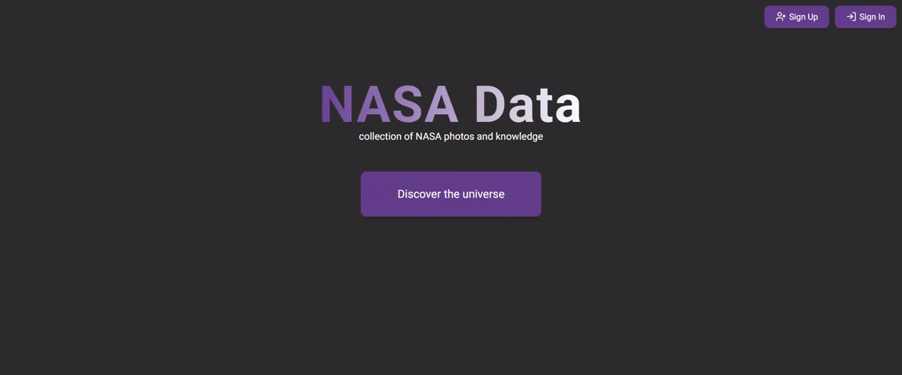

# NASA data

**Приложение с фотографиями [NASA](https://api.nasa.gov/) на Next.js, Redux и TypeScript.** Включает SSR и ISR, Firebase аутентификацию и Firestore для хранения коллекции фотографий пользователя.

## 🌐 Deployment

[Deployment](https://nasa-data-peach.vercel.app/)



## 🛠️ Technologies

- **TypeScript**
- **React**
- **Next.js**
- **Redux Toolkit**
- **Firebase** (Authentication, Firestore)
- **Tailwind CSS**
- **SCSS** (Sass)
- **Formik, Yup**
- **Jest, React Testing Library**
- **ESLint, Prettier**
- **Nasa API**

## 💻 Features

- Страница фотографии/видео дня **(ISR)**
- Поиск фотографий
- Информация о фото **в модальном окне** (название, полный размер фото, дата, центр/копирайт, описание)
- Отображение подборки фотографий "фото дня" перед выполнением поиска **(SSR)**
- Пагинация
- Регистрация **(Firebase Authentication)** по почте и паролю
- Авторизация **(Firebase Authentication)**
- **Валидация форм** регистрации и авторизации
- **Отправка письма для подтверждения почты** при регистрации
- Добавление фотографий в коллекцию **(Firestore)** - **кастомный хук useFavorites**
- Страница профиля
- **Кастомный хук useUserData** для получения данных пользователя
- **Коллекция фото** в профиле
- Сортировка добавленных фотографий по датам
- Редактирование профиля (доступно при подтверждённой почте)
- Переиспользуемые UI-компоненты (кнопки, инпуты, модальные окна, карточки фото, дропдауны, тосты)
- Покрытие тестами

## More details

### Routing

- **App Router**. Хуки usePathname, useRouter из next/navigation
- Защита маршрутов с помощью **AuthContext**
- Контент скрыт до завершения аутентификации
- **Редирект на профиль** после регистрации и авторизации
- **Редирект с адреса профиля на страницу авторизации** для неавторизованных пользователей
- **Страницы**:
  - Главная страница
  - Main (Photo of the day)
  - Search (поиск фото)
  - Registration
  - Login
  - Profile
  - Edit profile

### State management

- **createAsyncThunk** для запросов к API
- **Redux slices** для состояний фото и избранного
- **Firestore** для хранения данных о юзере и его коллекции фотографий
- Синхронизация между redux-стором и firestore

### Loading & error handling

- **Спиннер при загрузке** (поиск фото, загрузка профиля)
- **Тосты** с сообщениями:
  - Успешная и неуспешная регистрация/авторизация
  - Ошибка при загрузке данных профиля
- Общая страница ошибки **(error.tsx)**

### Form validation

- Валидация форм с **Yup** и **Formik**
- Регистрация:
  - Имя
  - Email (соответствие формату)
  - Пароль (не менее 6 символов)
- Все поля обязательны для заполнения
- Кнопка submit отключена при некорректном заполнении полей

### Profile page

- Имя, почта
- Коллекция фото
- Сортировка фото по дате
- Переход на страницу **редактирования профиля** (необходимо подтверждение почты)

### Performance optimizations

- **next/image** для изображений
- **next/font** для шрифтов
- **revalidate** для кэширования результата запроса

### Styling and responsiveness

- Адаптивная вёрстка до 360px ширины экрана (Tailwind CSS)
- Навигационная панель складывается в **бургер-меню** при ширине менее 912px
- Модальные окна подстраиваются под контент
- Кнопки поиска и отправки форм неактивны при некорректном заполнении полей

### Error handling in API

- Недостающие данные заменяются **заглушками**
- API возвращает полный url следующей страницы. В createAsyncThunk передается либо значение поиска при первом запросе, либо url для пагинации
- **http в url для пагинации заменяется на https** (для исключения двойного запроса с редиректом)

### Safety

- Ключ API и ключи Firebase хранятся в .env
- Настроены **правила безопасности в Firestore**
- **Защита маршрутов**

## 📁 Architecture

```bash
__tests__
public/
src/app/
├── context/
├── hooks/
├── lib/
├── main/
├── redux/
├── shared/
├── ui/
```

## 🪄 How to start project

clone the repository:

```bash
git clone
```

in the project directory enter:

```bash
npm install
```

create **.env.local** file with _env.example_ in the root directory and then run:

```bash
npm run dev
```

lint:

```bash
npm run lint
```

build the project:

```bash
npm run build
```

production mode:

```bash
npm start
```
